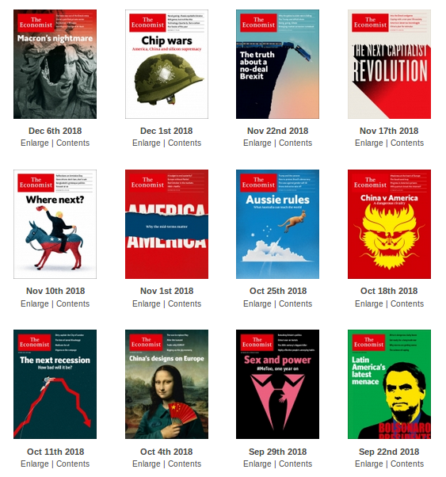
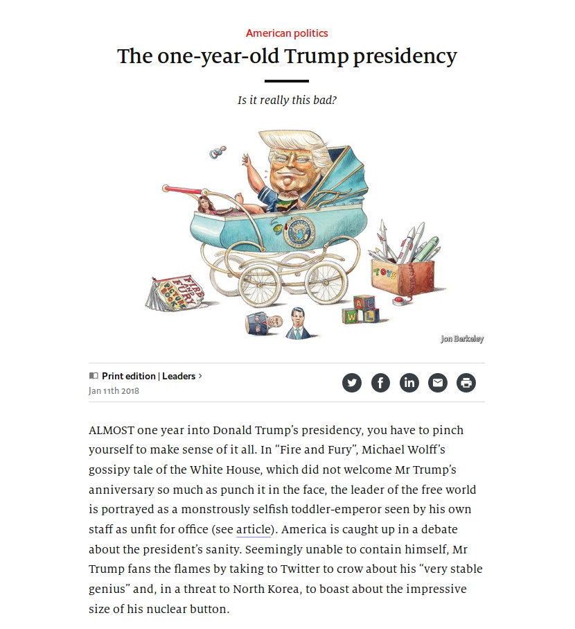

```{r setup, include=FALSE}
knitr::opts_chunk$set(echo = TRUE)
library(feather)
library(tidyverse)
library(lubridate)
library(ggthemes)
library(tidytext)
library(wordcloud)
```


```{r loading and cleaning ,echo=FALSE, cache=TRUE, warning = FALSE,message = FALSE }
#Paragraph analysis

#load db and separate in different years, primary key given by year, number_edition, number_article
df=read_feather(path="my_data2_v1.feather")
df$date=as.Date(df$date)
df$year=year(df$date)
df$ID <- seq.int(nrow(df))
df=filter(df,year!=2014)
#adding a single number for edition
df$unique_edition=df$number_edition+((df$year-2015)*51)
#cleaning html parsing problems
df$article=gsub("Get 3 free articles per week, daily \n newsletters and more.","",df$article)
df$article=gsub("Upgrade your inbox and get our Daily Dispatch and Editor's Picks.","",df$article)
#Clean sections column
df$section=gsub("print-edition icon Print edition \\|"," ",df$section)
df$section=gsub("^\\s+","",df$section)
df$location=gsub("\\| ","",df$location)
#unique(df$section)


#n_distinct(df$section) #26 is ok
#n_distinct(df$location) #way too much
#Length of articles
df=df%>%
  mutate(Nwords=str_count(article," ")-1)

#filter very short articles
df = df %>%
  filter(Nwords>250)
```


# Main Idea

- aa


# Data gathering

## 

## A little magic transformed this:


## Into that:




## Collected data

We collected 3 years of articles from "The Economist" magazine:

- 12650 articles
- 3 years collected: 2015,2016 and 2017.
- Additional metadata such as title, date, section and place.
- The data were collected using the Python libraries "Request" and "BeautifulSoup"
- A total of 9 Gb of raw html documents has been downloaded


# The analysis

## First step: data cleaning

- Parsing the HTML documents to obtain the articles
- Cleaning the text from HTML annotations
- Preparing it for text analysis 


## Number of words in the articles
```{r Distribution lenght,cache=TRUE,echo=FALSE}
df%>%
  filter( Nwords >250)%>%
  ggplot(aes(x=Nwords))+
  geom_histogram(binwidth = 30)+
  labs(x="Words number (bins are 30 days)",
       y="Count",
       title="Distribution of articles length",
       fill="",
       caption = "Based on the online european editions of \"The Economist\"",
       fill = "Topic")+
  theme_minimal()+
  scale_fill_gdocs()
```

## Who are we talking about?
```{r relative frequencies,echo=FALSE, cache=TRUE}
#retain articles talking about trump (mentioning his name at least once)
trump=df%>%
  filter(str_detect(article,"Donald Trump"))%>%
  add_column(flag="Trump")
#same for Clinton
clinton=df%>%
  filter(str_detect(article,"Hillary Clinton"))%>%
  add_column(flag="Clinton")
#same for Brexit
brexit=df%>%
  filter(str_detect(article,"Brexit"))%>%
  add_column(flag="Brexit")
#test baseline
test=df%>%
  filter(!str_detect(article,"Trump") & !str_detect(article,"Clinton") )%>%
  add_column(flag="Test")
#scientific test
science=df%>%
  filter(section=="Science and technology")%>%
  add_column(flag="Science")

#merging
politicalDf=bind_rows(trump,clinton,brexit,test,science)

#plotting relative frequencies divided by section
p=politicalDf%>%
  filter(flag!="Test"&flag!="Brexit"&flag!="Science")%>%
  group_by(section)%>%
  filter(n()>=80)

ggplot(p,aes(x=date,fill=as.factor(flag)))+
  
  geom_histogram(position = "fill",binwidth = 30)+
  labs(x="Date (bins are 20 days)",
       y="Normalized frequency",
       title="Trump vs Clinton",
       fill="",
       caption = "Based on the online european editions of \"The Economist\"",
       fill = "Topic")+
  geom_vline(xintercept = as.Date("2015-06-16"), col='black', lwd=0.5)+
  geom_vline(xintercept = as.Date("2016-11-08"), col='black', lwd=0.5)+
  geom_label( mapping = aes(label = "Start", x=as.Date("2015-06-26"),y = 0),inherit.aes = FALSE)+
  geom_label( mapping = aes(label = "End", x=as.Date("2016-11-15"),y = 0),inherit.aes = FALSE)+
  scale_fill_manual(breaks = c("Clinton", "Trump"), 
                      values=c("#b82e2e", "#316395"))+

  theme_light()

```


```{r paragraph,cache=TRUE }
#estraiamo i paragrafi

trump=df%>%
  unnest_tokens(paragraph,article, token = stringr::str_split, pattern = "\\.")%>%
  filter(str_detect(paragraph,"trump"))%>%
  add_column(flag="Trump")
clinton=df%>%
  unnest_tokens(paragraph,article, token = stringr::str_split, pattern = "\\.")%>%
  filter(str_detect(paragraph,"clinton"))%>%
  add_column(flag="Clinton")
brexit=df%>%
  unnest_tokens(paragraph,article, token = stringr::str_split, pattern = "\\.")%>%
  filter(str_detect(paragraph,"brexit"))%>%
  add_column(flag="Brexit")
test_base=df%>%
  unnest_tokens(paragraph,article, token = stringr::str_split, pattern = "\\.")%>%
  add_column(flag="test")
```

```{r sentiment, cache=TRUE}

#sentiment analysis
set.seed(42)
test_base1=sample_n(test_base,20000)
politicalDf=bind_rows(trump,clinton,brexit,test_base1)

tidyPoliticalDf=politicalDf%>%
  unnest_tokens(word,paragraph)
tidyNoStopPoliticalDf=tidyPoliticalDf%>%
  anti_join(stop_words)


#Afinn mean value
afinn=get_sentiments(lexicon = "afinn")
politicalSentiment=inner_join(tidyNoStopPoliticalDf,afinn,by = "word")
politicalSentiment=politicalSentiment%>%
  #group_by(ID)%>%
  mutate(mean=median(score))


```

## What do you think about me?
- Sentiment analysis
- Used the Afinn dataset (2476 words labelled from -5 (negative) to 5 (positive))
- Compared the occurrences of those words in time associated to paragraphs containing some keywords
-Let's see the results...

## Time changes everything

```{r Afinn plot , echo=FALSE, cache=TRUE}

politicalSentiment%>%
  filter(flag=="Trump"|flag=="Clinton"| flag=="test")%>%
  ggplot(aes(x=date,y=score,color=flag))+
  #geom_point()+
  geom_smooth(method = "loess", size = 1.5)+
  #geom_smooth()+
  labs(x="Date",
       y="Normalized frequency",
       title="Median sentiment evolution",
       fill="",
       caption = "Based on the online European editions of \"The Economist\"",
       color = "Topic")+
    scale_color_manual(breaks = c("Clinton", "Trump","test"), 
                      values=c("#b82e2e", "#ff9900","#316395"))+
geom_vline(xintercept = as.Date("2015-06-16"), col='black', lwd=0.5)+
  geom_vline(xintercept = as.Date("2016-11-08"), col='black', lwd=0.5)+
   theme_light()
    

  #geom_label( mapping = aes(label = "Start", x=as.Date("2015-06-26"),y = 0),inherit.aes = FALSE)+
  #geom_label( mapping = aes(label = "End", x=as.Date("2016-11-15"),y = 0),inherit.aes = FALSE)+

```

## Changes in word usage

We wanted to analyze daily word occurences and see which words had the most significant change in their usage.

- Sentiment analysis allowed us to filter out the neutral words and only consider the **extreme** ones;
- We calculated daily word occurrences for each month;
- For each possible date in our dataset, we extracted the word showing the highest difference in occurrence from the average monthly amount.


## Changes in word usage

```{r word occurrences , echo=FALSE, cache=TRUE, warning=FALSE, message = FALSE}

library(feather)
library(tidyverse)
library(lubridate)
library(ggthemes)
library(tidytext)


# DATA PREPROCESSING

#load db and separate in different years, primary key given by year, number_edition, number_article
data=read_feather(path="my_data2_v1.feather")
data$date=as.Date(data$date)
data$year=year(data$date)
data$ID <- seq.int(nrow(data))
#df=filter(df,year!=2014) # now removing any year now
#adding a single number for edition
data$unique_edition=data$number_edition+((data$year-2015)*51)

# DATA CLEANING

# Clean text from wrongly parsed html
#data$article=gsub("Get 3 free articles per week, daily \n newsletters and more.","",data$article)

# remove rows having empty string as an article
# sum(df[!(df$article==""), ]) # there are 3 empty articles we have to remove
data <- data[!(data$article==""), ]

# SENTIMENT ANALYSIS

# split article column into single words
df=data%>%unnest_tokens(word,article)

#removing stop words
data("stop_words")
df = df%>% anti_join(stop_words)

#dataset from tidytext
#sentiments

# scores from -5 to 5
afinn=get_sentiments(lexicon = "afinn")

# positive and negative
loughran=get_sentiments(lexicon = "loughran")

#######################################################

# let's filter all extreme positive and negative sentiments

# loughran negative or positive or litigious
loughran_neg <- loughran %>% 
  filter(sentiment %in% c("negative", "litigious"))
loughran_pos <- loughran %>% 
  filter(sentiment == "positive")

# afinn <-1 and >1
afinn_neg <- afinn %>% filter(score < -2)
afinn_pos <- afinn %>% filter(score >2)

extreme_words <- c(loughran_neg$word, loughran_pos$word,afinn_neg$word,afinn_pos$word)

# I only want the dataset to have the extreme sentiment words
extreme_df <- df %>% 
  filter(word %in% extreme_words)

# initializing sentiment column
extreme_df$sentim_categ <- NA

# positive words
extreme_df$sentim_categ[extreme_df$word %in% c(loughran_pos$word, afinn_pos$word)] <- 1

# negative words
extreme_df$sentim_categ[extreme_df$word %in% c(loughran_neg$word, afinn_neg$word)] <- -1


#######################################################

# How are the peaks related to specific events?
# I am not interested in the top words but in the 
# significant differences from the mean value!

# avg occurrence of all words in the month
avg_daily_freq <- extreme_df %>% 
  group_by("month"=month(date), word) %>% 
  count(word) %>% 
  summarise(avg_daily_freq = mean(n)/30)

# then I consider all the differences from the mean of
# current month
daily_counts <- extreme_df %>% 
  group_by(date, word, sentim_categ) %>% 
  count(word) %>% 
  rename(freq=n) %>% 
  mutate(month=month(date))

# finally, for each day I calculate the word having 
# the highest distance from the monthly mean
daily_extremes <- daily_counts %>%  
  full_join(avg_daily_freq, by=c("month","word")) %>% 
  mutate(std_freq=freq-avg_daily_freq) %>% 
  group_by(date) %>% 
  filter(std_freq==max(std_freq)) %>%
  arrange(desc(std_freq))

# Now i want to create a column indicating the elements 
# I want to label in my plot
num_labels = 20
  
max=daily_extremes$std_freq[num_labels]

daily_extremes <- daily_extremes %>% 
  mutate(extr_values=as.logical(std_freq > max)) %>% 
  filter(std_freq >= 0) 

daily_extremes$word[daily_extremes$extr_values == FALSE] <- NA
daily_extremes <- daily_extremes[!duplicated(daily_extremes[c('date')]),]

daily_extremes %>%
  group_by(sentim_categ) %>% 
  ggplot(aes(x=date, weight=std_freq, fill=word))+
  geom_histogram(binwidth = 1, labels = word)+
  #facet_grid("flag")+
  labs(x="Date",
       y="Frequency increment (%)",
       title="Words having the most significant increment in frequency",
       subtitle = "Calculated on monthly averages",
       fill="",
       caption = "Source: online european editions of \"The Economist\"")+
  geom_text(aes(x=date, y=std_freq+1, label=word, color=word))+
  theme(legend.position="none")+
  theme(panel.background = element_blank())

```
